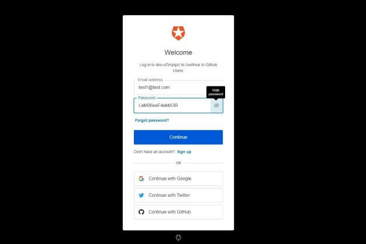
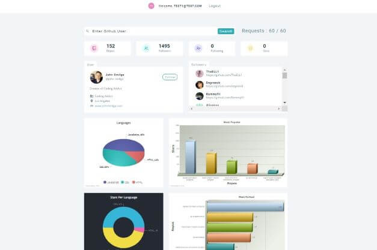

# React - GithubUser

[This project](https://gurhanalan.github.io/React-GithubUser/) is component that lists Github user information from Github API, and presents the info in a dashboard to the user. This component is build with using React.

## Table of contents

- [React - GithubUser](#react---githubuser)
  - [Table of contents](#table-of-contents)
  - [Overview](#overview)
    - [The challenge](#the-challenge)
    - [Screenshots](#screenshots)
    - [Links](#links)
  - [My process](#my-process)
    - [Built with](#built-with)

## Overview

### The challenge

Users should be able to:

-   Get the list of questions from API call
-   Select the categories of questions
-   Answer questions and see results
-   Restart the quiz

### Screenshots

 
 
 

### Links

-   Solution URL: [Live Website](https://gurhanalan.github.io/React-GithubUser/)

## My process

### Built with

-   React
-   Functional Components
-   CSS
-   Styled Components
-   React Hooks
-   API
-   Auth0() Authentication
-   Fusion Charts
